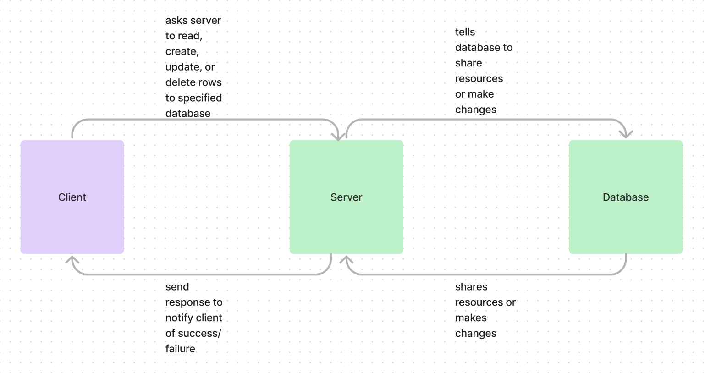

# Basic Express Server

# Brandon Mizutani

The purpose is to create an express server to get more practice with express.Router, Jest, and relational databases. 

## Cloud Deploy

### Running the app
npm start

### Tests
Unit Tests: npm test

### Whiteboard

# To Do List Lab 03:

Install:
~~  - npm i sequelize sqlite3 pg~~
~~Add the connection to my postgres sql db~~
~~Build out a model~~
Start writing our crud related routes

~~use modular routing (use express.router)~~
 ~~ - Get records~~
  ~~- Add a record~~
 ~~ - Get a single record~~
  ~~- Update a record~~
  - Delete a record

Talk about testing
